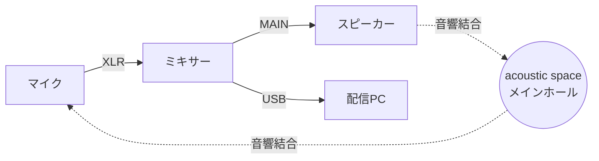
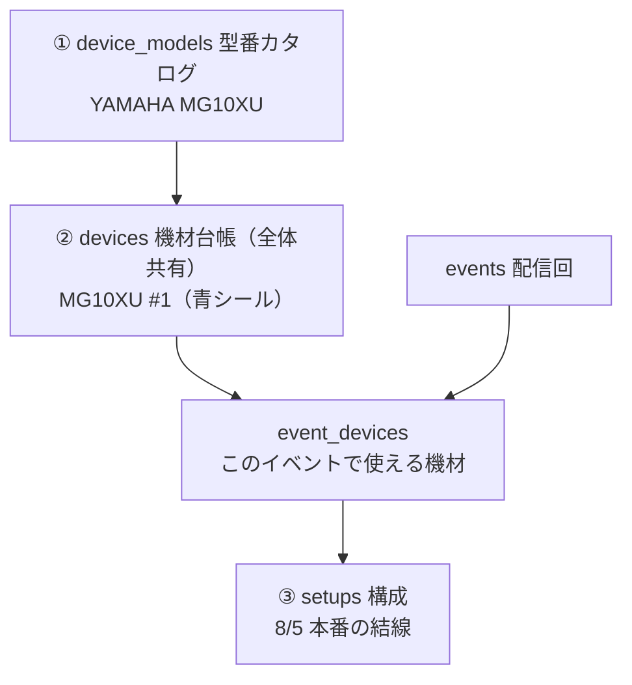
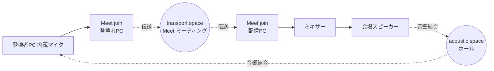

# stream.gdgs.jp — 配信・音響機材構成ツール 設計 (MVP)

**作成日:** 2026-08-05
**最終更新:** 2026-08-09
**ステータス:** 実装済み

## 1. 位置づけ

イベント配信支援の 3 機能構想のうち、2 つ目にあたる。

1. GDG CLI の機能追加 — OBS Studio と拡張機能をコマンド一発で設定
2. **stream.gdgs.jp — 機材構成の登録・表現・検査** ← 本書
3. OBS Studio 拡張 — 構成をインポートし、映像・音声フローを視覚的に確認・変更

MVP では AI による提案機能は実装しない。**配信機材の構成をどう表現するか**と、
**構成上の問題を検出する Linter** の 2 点に集中する。AI 提案は次フェーズとし、
本書のデータモデルと Linter がその土台（生成物の検証器）になるよう設計する。

新規 pnpm ワークスペース `stream/` として作成し、`stream.gdgs.jp` で公開する。
既存 RP と同じ React Router v7 + Cloudflare Workers + D1 構成、認証は `gdg-lib` の
`initializeRpAuth` による Accounts OIDC RP。

## 2. 設計上の中核アイデア

### 2.1. 空間 (Space) をグラフのノードとして扱う

本ツールで最も重要な決定。

ハウリングは「マイク → ミキサー → スピーカー → **空気** → 同じマイク」という閉路である。
配線だけをグラフ化しても検出できない。そこで**空気（音響空間）をノードとしてグラフに入れる**。

同じ構造は映像にも存在する。無限鏡は「OBS 出力 → プロジェクタ → スクリーン → **視界** →
カメラ → OBS」であり、音のハウリングと構造が完全に一致する。

したがって `Space` ノードを 2 種類持つ。

| kind | 出力する側 | 入力する側 |
| --- | --- | --- |
| `acoustic` | スピーカー | マイク |
| `visual` | ディスプレイ・プロジェクタ | カメラ |

この暗黙エッジをグラフ構築時に自動生成することで、

- ハウリング
- リモート登壇者へのエコー返り (Mix-Minus 違反)
- 配信経由の遅延ハウリング
- 無限鏡

の 4 つが、**すべて単一の閉路検出アルゴリズムで検出できる**。

ただし 3 つ目の「配信経由の遅延ハウリング」は、オンライン伝送そのものを空間として
表現しないと成立しない。9 章で扱う。

空間は複数持てる（メインホール / 別室サテライト / 配信オペ席）。異なる空間のスピーカーと
マイクは結合しない。ヘッドセット・イヤモニ・カナル型は `coupling: "isolated"` として
暗黙エッジを張らない。



### 2.2. ミキサー内部は boolean ルーティング行列に妥協する

ミキサーの配線を本格的に表現すると、当日のセットアップと不具合修復が破綻する。
そこで**内部状態は「入力ch × バス」の boolean 行列のみ**とし、ゲイン・EQ・コンプ・
フェーダー値・パンは一切持たない。

閉路検出に必要な情報は「その信号がそのバスに乗るか否か」だけであり、dB 値は不要である。
これが表現力と記入コストの均衡点になる。

バスは `main` / `aux1..n` / `usb` / `monitor` / `sub` の種別を持つ。出力ポートは
いずれかのバスに属し、`入力ch → バス → そのバスの出力ポート` という内部エッジになる。

機材によって内部の振る舞いが違うため、型番は `internal_routing` を持つ。

| 値 | 意味 | 該当機材 |
| --- | --- | --- |
| `matrix` | 上記の boolean 行列に従う | ミキサー、オーディオ I/F、スイッチャー、OBS |
| `passthrough` | 全入力が同じ媒体の全出力へ流れる | DI、ワイヤレス受信機、会場常設 PA |
| `none` | 入力と出力は無関係 | マイク・スピーカー等の端点、および会議アプリ |

会議アプリを `none` にするのは必須である。Meet や Zoom はローカルのマイク入力をローカルの
スピーカー出力へ回さない。ここを `passthrough` にすると、存在しないエコー閉路を検出器自身が
作り出してしまう。会議アプリが複数の接続点を持つ場合の扱いは 9 章で改める。

### 2.3. PC は内部パッチベイとして扱う

Mix-Minus 違反の大半は、機材の配線ではなく **PC 上のアプリケーションの入出力デバイス選択**で
発生する。「Meet の出力先がスピーカーになっている」「OBS のモニタリング出力が有効なまま」など。

そこで PC を単一のブラックボックスにせず、**PC 上に載るソフトウェアデバイスをノードとして
表現し、PC の物理ポートとの間に内部エッジを張る**。

- `n_pc` — 物理ポート (USB, ヘッドホン出力, HDMI) を持つ
- `n_meet` — `hostNodeId: "n_pc"`。論理ポート `audio_in` / `audio_out` を持つ
- `n_obs` — `hostNodeId: "n_pc"`。`audio_in` / `video_in` / `monitor_out` / `stream_out` を持つ

内部エッジ `n_meet.audio_out → n_pc.usb_in` が「Meet の出力先が USB オーディオ I/F」を意味する。
これにより、リモートエコーの原因が「電気的経路」なのか「音響的回り込み」なのかまで切り分けられ、
提示すべき修正手順が変わる（前者はルーティング行列、後者はヘッドセット化）。

ここで結線の向きに 1 つ例外が要る。PC の物理出力端子は、外から見れば出力だが、PC の内側から
見ればアプリが音を流し込む先である。したがってソフトウェアノードとそのホスト PC の間だけは、
`出力 → 出力`（アプリがヘッドホン端子へ再生する）と `入力 → 入力`（アプリが USB 入力から
取り込む）を許可し、グラフ構築側で正しい向きに解釈する。通常の結線は常に `出力 → 入力`。

また、ポートは必ず `in` か `out` のいずれかとし、双方向ポートは作らない。USB オーディオは
送りと戻りで 2 つのポート・2 本のリンクとして表現する。1 本の USB ケーブルを 2 リンクで書く
のは冗長に見えるが、Mix-Minus はまさにその 2 方向の非対称性の問題なので、ここは分けたほうが
正しく検出できる。UI 側で「USB オーディオ接続」として 2 本まとめて張るショートカットを出す。

## 3. データモデル

機材は 3 層に分ける。**機材台帳はチャプターに紐づけず、gdgs.jp にログインできるユーザー間で
共有する単一プール**とする（機材が複数チャプターで共有されるため）。イベントごとに
「利用可能な機材」を台帳から選択し、構成はその部分集合の範囲内で組む。



### 3.1. 型番カタログ

D1 にユーザーが登録する。よく使う型番は migration のシードデータとして投入し、
初期状態でも空にならないようにする。将来の AI 提案では、AI に**カタログ ID からのみ
選択させる**制約を掛け、存在しない機材の捏造を防ぐ。

```sql
CREATE TABLE device_models (
  id          TEXT NOT NULL PRIMARY KEY,
  maker       TEXT,
  name        TEXT NOT NULL,
  category    TEXT NOT NULL,   -- 3.2 参照
  -- matrix | passthrough | none。2.2 参照
  internal_routing TEXT NOT NULL DEFAULT 'none',
  notes       TEXT,
  created_by  TEXT,
  created_at  INTEGER NOT NULL DEFAULT (unixepoch()),
  updated_at  INTEGER NOT NULL DEFAULT (unixepoch())
);

CREATE TABLE device_model_buses (
  id        TEXT NOT NULL PRIMARY KEY,
  model_id  TEXT NOT NULL REFERENCES device_models(id) ON DELETE CASCADE,
  key       TEXT NOT NULL,     -- "main" | "aux1" | "usb" | "monitor" | "sub1"
  label     TEXT NOT NULL,
  kind      TEXT NOT NULL,     -- main | aux | usb | monitor | sub
  UNIQUE (model_id, key)
);

CREATE TABLE device_model_ports (
  id          TEXT NOT NULL PRIMARY KEY,
  model_id    TEXT NOT NULL REFERENCES device_models(id) ON DELETE CASCADE,
  key         TEXT NOT NULL,   -- "ch1" | "main_out_l" | "usb" | "audio_in"
  label       TEXT NOT NULL,
  direction   TEXT NOT NULL,   -- in | out
  -- av は HDMI/SDI のように 1 本で音声と映像の両方を運ぶもの
  signal      TEXT NOT NULL,   -- audio_analog | audio_digital | video | av
  connector   TEXT,            -- xlr | trs | ts | trs_mini | rca | hdmi | sdi | usb_c | usb_b | speakon | none
  level       TEXT,            -- mic | line | instrument | speaker  (映像・論理ポートは NULL)
  channels    INTEGER NOT NULL DEFAULT 1,
  phantom     TEXT NOT NULL DEFAULT 'none',  -- provides | requires | none | damaged_by
  bus_id      TEXT REFERENCES device_model_buses(id) ON DELETE SET NULL,  -- 出力ポートのみ
  sort_order  INTEGER NOT NULL DEFAULT 0,
  UNIQUE (model_id, key)
);

-- 型番レベルの既定ルーティング（構成側で上書きされる初期値）
CREATE TABLE device_model_default_routes (
  model_id    TEXT NOT NULL REFERENCES device_models(id) ON DELETE CASCADE,
  in_port_id  TEXT NOT NULL REFERENCES device_model_ports(id) ON DELETE CASCADE,
  bus_id      TEXT NOT NULL REFERENCES device_model_buses(id) ON DELETE CASCADE,
  PRIMARY KEY (model_id, in_port_id, bus_id)
);
```

実際にどの ch を AUX へ送るかはイベントごとに変わるため、**ルーティング行列の実値は構成
(setup) 側が持つ**。型番側はテンプレートに徹する。

### 3.2. カテゴリと空間結合

`category` は Linter の暗黙エッジ生成規則を決める。

| category | 空間結合 | 備考 |
| --- | --- | --- |
| `mic` | acoustic → out ポート | `isolated` でピンマイク・ヘッドセットを表現 |
| `speaker` | in ポート → acoustic | 配信専用モニターは `isolated` |
| `headphone` | なし | 既定で isolated |
| `camera` | visual → out ポート | |
| `display` | in ポート → visual | プロジェクタ含む |
| `mixer` / `audio_interface` / `di` / `wireless_rx` / `switcher` / `capture` / `recorder` | なし | バスとルーティング行列を持つ |
| `computer` | なし | ソフトウェアデバイスのホスト |
| `software_broadcast` | なし | OBS 等。`hostNodeId` 必須 |
| `software_conferencing` | なし | Meet / Zoom 等。`hostNodeId` 必須 |
| `blackbox` | なし | 会場常設 PA。内部は「全入力 → 全出力」と保守的に仮定 |
| `generic` | なし | 該当なし |

会場備え付けの常設 PA は `category = 'blackbox'` の型番として登録し、入出力端子だけ
定義する。内部が不明なため Linter は安全側（結合していると仮定）に倒して警告を出す。
当日に実機を確認できたら通常の型番として作り直せる。

### 3.3. 機材台帳（全体共有プール）

```sql
CREATE TABLE devices (
  id           TEXT NOT NULL PRIMARY KEY,
  model_id     TEXT NOT NULL REFERENCES device_models(id),
  name         TEXT NOT NULL,   -- "MG10XU #1"
  identifier   TEXT,            -- 現物識別の目印（青シール、資産番号など）
  owner_note   TEXT,            -- "東京チャプター備品" / "田中さん私物"（メモ。権限とは無関係）
  created_by   TEXT,
  created_at   INTEGER NOT NULL DEFAULT (unixepoch()),
  updated_at   INTEGER NOT NULL DEFAULT (unixepoch()),
  deleted_at   INTEGER
);
```

`owner_note` は自由記述のメモであり、アクセス制御には使わない。ログインユーザーは全機材を
閲覧・追加でき、編集・削除は作成者と管理者に限る。

### 3.4. イベントと構成

```sql
CREATE TABLE events (
  id            TEXT NOT NULL PRIMARY KEY,
  title         TEXT NOT NULL,
  starts_at     INTEGER,
  venue         TEXT,
  external_url  TEXT,          -- connpass 等への任意リンク
  created_by    TEXT,
  created_at    INTEGER NOT NULL DEFAULT (unixepoch()),
  updated_at    INTEGER NOT NULL DEFAULT (unixepoch()),
  deleted_at    INTEGER
);

-- このイベントで利用可能な機材（台帳からの選択）
CREATE TABLE event_devices (
  event_id   TEXT NOT NULL REFERENCES events(id) ON DELETE CASCADE,
  device_id  TEXT NOT NULL REFERENCES devices(id) ON DELETE CASCADE,
  note       TEXT,             -- "田中さんが持参"
  PRIMARY KEY (event_id, device_id)
);

CREATE TABLE setups (
  id          TEXT NOT NULL PRIMARY KEY,
  event_id    TEXT NOT NULL REFERENCES events(id) ON DELETE CASCADE,
  name        TEXT NOT NULL,   -- "本番構成" / "リハ構成"（MVP では時間的に排他な代替案）
  doc         TEXT NOT NULL,   -- 構成ドキュメント JSON（3.5）
  created_by  TEXT,
  created_at  INTEGER NOT NULL DEFAULT (unixepoch()),
  updated_at  INTEGER NOT NULL DEFAULT (unixepoch())
);

CREATE TABLE setup_revisions (
  id          TEXT NOT NULL PRIMARY KEY,
  setup_id    TEXT NOT NULL REFERENCES setups(id) ON DELETE CASCADE,
  doc         TEXT NOT NULL,
  author_id   TEXT,
  created_at  INTEGER NOT NULL DEFAULT (unixepoch())
);
```

### 3.5. 構成ドキュメント (JSON)

構成本体は正規化せず、**単一の JSON ドキュメント**として持つ。ノード数は高々数十であり、
Linter・AI 提案・OBS 拡張へのエクスポートのすべてがこの 1 ドキュメントを入出力とするため、
この形が最も素直である。読み込み時に zod でバリデートする。

**座標を持たない。** 図は毎回自動レイアウト（dagre / ELK）で描画する。これにより、
将来 AI が生成した JSON がそのまま図になり、レイアウト情報の生成・整合という厄介な問題を
回避できる。

```jsonc
{
  "schemaVersion": 1,
  "spaces": [
    { "id": "sp_hall",   "kind": "acoustic", "label": "メインホール", "venueKey": "hall-a" },
    { "id": "sp_screen", "kind": "visual",   "label": "正面スクリーン" }
  ],
  "nodes": [
    {
      "id": "n_mic1",
      "deviceId": "dev_...",       // event_devices に含まれている必要がある
      "label": "登壇者ハンドマイク",
      "spaceId": "sp_hall",
      "coupling": "open"            // open | isolated
    },
    { "id": "n_mixer", "deviceId": "dev_mg10xu_1" },
    { "id": "n_pc",    "deviceId": "dev_pc_1", "label": "配信PC" },
    { "id": "n_obs",   "deviceId": "dev_obs",  "hostNodeId": "n_pc" },
    { "id": "n_meet",  "deviceId": "dev_meet", "hostNodeId": "n_pc" }
  ],
  "links": [
    { "id": "l1", "from": ["n_mic1", "out"],       "to": ["n_mixer", "ch1"] },
    { "id": "l2", "from": ["n_mixer", "usb_send"], "to": ["n_pc", "usb_in"] },
    // ホストの物理入力からソフトウェアへ (in → in の例外)
    { "id": "l3", "from": ["n_pc", "usb_in"],      "to": ["n_meet", "mic_in"] },
    // ソフトウェアからホストの物理出力へ (out → out の例外)
    { "id": "l4", "from": ["n_meet", "spk_out"],   "to": ["n_pc", "usb_out"] }
  ],
  "routing": [
    // ミキサー等の内部ルーティング行列。ここが「妥協」の中心。
    { "nodeId": "n_mixer", "inPort": "ch1",    "bus": "main" },
    { "nodeId": "n_mixer", "inPort": "ch1",    "bus": "aux1" },
    { "nodeId": "n_mixer", "inPort": "ch1",    "bus": "usb"  }
    // usb_in → usb を含めないことが Mix-Minus。含めると remote-echo-electrical が出る。
  ],
  "notes": "..."
}
```

`routing` は**存在する組み合わせのみを列挙**する（boolean 行列の疎表現）。UI 上は
チェックボックスの表として編集する。

`spaces[].venueKey` は物理空間の識別子で、MVP では使わない。複数トラック同時開催
（8 章）で構成ドキュメントが分割されたとき、**別ドキュメントに現れる同じ物理空間を同一と
みなす**ために必要になる。ドキュメントの自己完結性を保ったままトラック横断の音響結合を
表現できる唯一の手段であり、後付けが難しいため最初からスキーマに含めておく。

## 4. Linter

### 4.1. グラフ構築

診断の前に、以下 4 種類のエッジから有向グラフを組む。

1. **明示リンク** — `links`（ケーブル結線）
2. **デバイス内部エッジ** — `routing` から `入力ポート → バス → そのバスの出力ポート`
3. **ホスト内部エッジ** — ソフトウェアデバイスの論理ポートと、ホスト PC の物理ポートの対応
4. **空間の暗黙エッジ** — `speaker → acoustic space → mic`、`display → visual space → camera`
   （`coupling: "isolated"` のノードは除外。`blackbox` は全入力 → 全出力を仮定）

エッジは種別を保持し、閉路を報告する際に「どこが音響結合でどこが配線か」を提示できるようにする。

### 4.2. ルール

優先度は実際に GDG イベントで遭遇したトラブル（ハウリング / リモート登壇者へのエコー返り /
配信に音声が乗っていない）に合わせ、**MVP は音声系に集中**する。映像はモデルとしては
表現するが、検査は未接続チェックに留める。

#### critical

| ruleId | 内容 |
| --- | --- |
| `acoustic-feedback-loop` | acoustic space を含む閉路。ハウリング。閉路の経路と、切断候補（AUX からの除外、isolated 化）を提示 |
| `remote-echo-electrical` | 会議ソフトの `audio_out` が電気的経路のみを通って自身の `audio_in` に戻る。Mix-Minus 違反。切るべき routing の組み合わせを名指しする |
| `remote-echo-acoustic` | 会議ソフトの出力がスピーカー経由でマイクに回り込み `audio_in` に戻る。修正はヘッドセット化またはスピーカーの isolated 化 |
| `no-audio-to-stream` | 配信ソフトの `audio_in` に、どのマイクからも到達できない。無音アーカイブの最悪ケース |
| `stream-monitor-loop` | 上記のハウリング閉路が配信ソフトを経由している場合の分類。修正手順が異なる（モニタリングをオフ／ヘッドホンへ）ため別 ruleId にするが、`acoustic-feedback-loop` と重複しては報告しない |

#### error

| ruleId | 内容 |
| --- | --- |
| `level-mismatch` | line 出力 → mic 入力（PAD 必要）、speaker 出力 → line 入力（機材破損の危険） |
| `signal-mismatch` | audio ポートに video を接続するなど、信号種別が成立しない結線 |
| `link-direction` | 出力 → 入力になっていない結線（ホストとソフトウェアの間の例外を除く） |
| `phantom-missing` | `phantom: requires` の機材が、供給できない入力端子に接続されている |
| `phantom-hazard` | ファンタム供給可能なポートに `phantom: damaged_by` の機材（リボンマイク等）が接続されている |
| `device-not-in-event` | 構成が参照する機材が、そのイベントの利用可能機材に含まれていない |
| `unknown-reference` | 存在しない機材・型番・端子・空間・バスを参照している |
| `space-kind-mismatch` | 音響機材を視覚空間に割り当てている、またはその逆 |

#### warn

| ruleId | 内容 |
| --- | --- |
| `visual-feedback-loop` | 映像の閉ループ（無限鏡）。配信画面を会場スクリーンに出しカメラが写し込んでいる |
| `space-unassigned` | マイクやスピーカーがどの空間にも割り当てられておらず、ハウリング判定ができない |
| `connector-mismatch` | XLR → RCA など、変換ケーブルが必要な結線。当日の持ち物として通知 |
| `blackbox-assumption` | ブラックボックス機材を内部全通と仮定して検査していることの明示。会場での確認を促す |
| `no-backup-recording` | 配信構成にバックアップ収録機がない |

#### info

| ruleId | 内容 |
| --- | --- |
| `dangling-port` | 端点機材（マイク・スピーカー・カメラ・ディスプレイ・レコーダー）の未結線端子。ミキサーの空きチャンネルは対象外 |
| `unreachable-device` | 構成に置かれているが、どの信号経路にも参加していない機材 |
| `video-not-reaching-stream` | 映像が配信ソフトに到達していない（映像系の唯一の MVP ルール） |

#### 実装上の割り切り

- **ファンタム電源は 1 ホップのみ**判定する。マイクが直接挿さっている入力端子が供給できるかだけを見る。
  途中に挟まったパッシブ機材が +48V を通すかどうかは知りようがないため、推測しない。
- **1 つの空間・1 つの会議アプリにつき閉路は 1 件だけ**報告する。実際の閉路は大量に重複するため、
  全列挙すると本命の指摘が埋もれる。1 件直して再実行する運用にする。

### 4.3. 診断の返却形

将来の AI 提案で **Linter が生成物の検証器になる**（提案 → Lint → エラーがあれば差し戻して
自己修正）。そのため、人間向け文言だけでなく機械可読な構造を最初から返す。

エントリポイントは最初から**第 2 引数に検査文脈を取る形**にする。MVP では `siblingSetups` は
常に空だが、複数トラック同時開催（8 章）で必要になるため、後からシグネチャを変えて全ルールの
実装を触ることを避ける。

```ts
export type LintContext = {
  models: Map<string, DeviceModel>;     // 構成が参照する型番
  eventDeviceIds: Set<string>;          // イベントの利用可能機材
  siblingSetups?: SetupDoc[];           // 同時に成立する他トラックの構成（MVP では空）
};

export function lint(doc: SetupDoc, ctx: LintContext): Diagnostic[];

export type Diagnostic = {
  ruleId: string;
  severity: "critical" | "error" | "warn" | "info";
  message: string;                 // 日本語の説明
  nodeIds: string[];
  linkIds: string[];
  cycle?: GraphEdge[];             // 閉路ルールの場合、経路（エッジ種別付き）
  fixes?: Fix[];                   // 機械適用可能な修正候補
};

export type Fix =
  | { kind: "disable-route"; nodeId: string; inPort: string; bus: string }
  | { kind: "set-coupling"; nodeId: string; coupling: "isolated" }
  | { kind: "remove-link"; linkId: string }
  | { kind: "add-device"; category: string; reason: string };
```

## 5. 画面構成 (MVP)

| ルート | 内容 |
| --- | --- |
| `/events` | 配信回の一覧 |
| `/events/:id` | イベント詳細。利用可能機材の選択、構成の一覧 |
| `/events/:id/setups/:setupId` | 構成エディタ（下記タブ） |
| `/devices` | 機材台帳（全体共有プール） |
| `/models` | 型番カタログ。ポート・バス・既定ルーティングの編集 |

構成エディタのタブ:

1. **機材** — イベントの利用可能機材から構成に追加。空間の割り当て、coupling の指定
2. **結線** — 出力ポート → 入力ポートの表形式入力
3. **ルーティング** — ミキサー等の `入力ch × バス` チェックボックス表
4. **図** — 自動レイアウトによる信号フロー図（読み取り専用）
5. **JSON** — 上級者向けの直接編集。イベント間コピーや AI へのペーストに使う

Lint 結果は常時表示し、診断クリックで該当ノード・結線をハイライトする。

視覚的なドラッグ結線編集は 3 機能目の OBS 拡張に寄せ、本ツールでは実装しない。

## 6. 明示的にやらないこと

過度な複雑化を避けるための線引き。当日のセットアップと不具合修復を最優先する。

- ゲイン、フェーダー値、EQ、コンプ、パン、ディレイ
- サブグループ、マトリクスミキサー、DCA
- パッチベイ、インサート、センドリターン
- ネットワークオーディオ (Dante / AVB / NDI) — 同一会場内の配線の代替であり、伝送の両端が
  同じ音響空間にある。別の音響空間へ繋ぐオンライン伝送 (Meet / VDO.Ninja) は 9 章で扱う
- ケーブル長、本数、在庫管理
- 電源系統、グラウンドループ
- 結線表の印刷出力、当日チェックリスト生成（今回のスコープ外と決定。次フェーズ候補）
- AI による構成提案（次フェーズ）
- 複数トラックの同時開催（8 章。拡張余地のみ確保し、実装はしない）

## 7. 実装配置

コアロジック（zod スキーマ、グラフ構築、Linter）は `stream/app/lib/av/` にピュア TS で置く。
`gdg-lib` は RP 認証と署名クッキーの責務に限定されており、リポジトリ方針も
「genuinely shared でない限りアプリローカルに保つ」であるため、現時点では切り出さない。

OBS 拡張および CLI へは API で JSON を返す。共有が実際に必要になった段階で
`gdg-lib` もしくは新パッケージへ切り出す。

```
stream/
  app/
    lib/av/
      types.ts         # 型番カタログ・機材台帳の TS 表現、空間結合の規則
      schema.ts        # zod: SetupDoc, Space, Node, Link, Route
      graph.ts         # SetupDoc + 型番情報 → 有向グラフ (cable/host/internal/space)
      paths.ts         # 媒体別の BFS。findPath / findCycle / reachableFrom
      diagnostics.ts   # Diagnostic, Fix, LintContext, 並び替えと共通ヘルパー
      rules/           # structure / connections / loops / coverage
      lint.ts          # lint(doc, ctx) — ルール実行と Diagnostic の集約
      fixtures.ts      # テスト用のミニカタログ
    routes/
  migrations/
  workers/
```

`diagnostics.ts` を `lint.ts` から分離しているのは、ルールが型だけを参照して循環 import を
避けるため。

## 8. 将来の拡張: 複数トラックの同時開催

DevFest のように 1 イベント内でホール A / ホール B / ワークショップ室が同時進行する形態は
MVP の対象外とする。ただし後から行き詰まらないよう、影響範囲を整理しておく。

### 8.1. 後付けで済むもの

- `event_tracks` テーブル（名称、開始・終了時刻、会場メモ）の追加
- `setups.track_id`、`event_devices.track_id` を nullable で追加（既存行は NULL のまま）

いずれも既存行の意味を変えないマイグレーションであり、MVP 時点で作る必要はない。

### 8.2. すでに満たされているもの

マルチトラックで最も価値が高い Linter ルールは、**同時進行する 2 トラックが同じ機材個体を
使っている**ことの検出（`device-double-booked`）である。これには機材台帳が「実物 1 台 =
1 レコード」であることが必須で、3.3 の設計はこれを満たしている。

台帳を「型番 + 数量」で持つ設計にしていた場合、どのトラックがどの個体を使うか特定できず
このルールは書けなくなる。**台帳を個体単位にする判断は、この拡張の前提条件である。**

### 8.3. MVP 時点で手当てしたもの

複数トラックでは構成ドキュメントをトラックごとに分割することになる。このとき、
`spaces` がドキュメント内に閉じているため、**別ドキュメントに現れる同じ物理空間が同一と
認識されない**。隣接する 2 部屋の仕切りが開いている、ホール A の音声をホワイエのスピーカーに
流していてそこにトラック B の受付マイクがある、といった構成でトラック横断の音響結合を
見落とす。

`spaces` を DB テーブルへ引き上げれば解決するが、構成ドキュメントの自己完結性が失われ、
OBS 拡張へのエクスポート・AI へのペースト・JSON タブでの直接編集がすべて複雑化する。
代償が大きすぎるため採らない。

代わりに `spaces[].venueKey`（3.5）を最初からスキーマに含め、**`venueKey` が一致する空間を
同一の物理空間とみなす**規則を将来追加できるようにした。文字列 1 つのコストで、
自己完結性を保ったままトラック横断の結合を表現できる。

同じ理由から `lint()` は最初から `LintContext.siblingSetups` を受け取る形にしてある（4.3）。

### 8.4. 用語の混在に注意

`setups` は「時間的に排他な代替案」（本番 / リハ / プラン B）と「同時に成立する別トラック」
（ホール A / ホール B）という異質な 2 つの意味を持ちうる。混在させると機材の二重使用判定が
書けなくなるため、**MVP では前者の意味に限定する**。トラックは `track_id` という別の軸として
導入し、`(track_id, name)` の組で一意になる形を想定する。

## 9. オンライン伝送ツール (Google Meet / VDO.Ninja) の扱い

MVP は Meet を「オンライン登壇者の入力系」として実装した。これは実際の使われ方の一部で
しかなく、モデルに構造的な欠落がある。8 章と違い、これは将来の拡張ではなく**出荷済みの
部分の欠陥**であり、修正を前提として書く。

> 実装済み。以下は設計判断の記録として残す。実装時に決めた追加事項は 9.10 にまとめた。

### 9.1. 何が欠けているか

現在の `software_conferencing` は「ミーティングへの接続点 (join) が構成内に 1 つしかない」
ことを前提にしている。型番 `m_meet` は `mic_in` / `spk_out` を持つ 1 ノードで、向こう側は
暗黙のブラックボックスである。`remote-echo-electrical` / `remote-echo-acoustic` も
`spk_out` から `mic_in` へのローカルな経路だけを見ている。

しかし Meet は少なくとも 3 通りに使われる。

| 形態 | join の数 | 現在のモデル |
| --- | --- | --- |
| オンライン登壇者が参加する | 1（会場側のみ） | 書ける |
| 現地登壇者が音声付きコンテンツを画面共有する | 2（配信 PC と登壇者 PC） | **書けない** |
| 別室・サテライトへ映像音声を配信する | 2 以上（部屋ごと） | **書けない** |

2 番目が最も危険である。登壇者のノート PC は会場の音響空間の中にあるため、次の閉路が
実在する。



これは AEC が消せない。AEC が打ち消せるのは「自分が自分のスピーカーへ出した音」だけで、
**別の join のスピーカーを経由して戻ってきた音は参照信号を持たない**。実際に起きる
ハウリングであり、しかも原因の機材（登壇者の私物 PC）が結線表のどこにも出てこないため、
当日いちばん切り分けに時間がかかる種類の事故である。

3 番目も構造は同じで、部屋 A の音響空間と部屋 B の音響空間が伝送経由で結合する。
2.1 が検出対象に挙げた「配信経由の遅延ハウリング」は、この結合を表現しない限り原理的に
検出できない。

### 9.2. 判断: 伝送路は機材ではなく空間である

2.1 が空気と視界に対して行った判断を、そのままミーティングに適用する。

- ミーティングそのもの = `kind: "transport"` の Space
- 各接続点 (join) = ノード。`hostNodeId` を持つ既存のソフトウェアノードのまま
- 暗黙エッジ = `join A の入力ポート → 伝送空間 → join B の出力ポート`（**B ≠ A**）

この「自分自身には返さない」除外規則が、会議ブリッジが内部で行っている Mix-Minus その
ものである。acoustic / visual との違いはこの一点だけで、閉路探索・`Diagnostic` の形・
「1 空間につき 1 件だけ報告する」方針はすべてそのまま再利用できる。

| kind | 出力する側 | 入力する側 | 自己除外 |
| --- | --- | --- | --- |
| `acoustic` | スピーカー | マイク | なし |
| `visual` | ディスプレイ・プロジェクタ | カメラ | なし |
| `transport` | join の入力ポート | join の出力ポート | **あり** |

### 9.3. 遠隔参加者は既定で暗黙、必要なら明示

構成内の join が 1 つだけの伝送空間は、「この join がミーティングに繋がっている」という
事実だけを表し、向こう側はモデル化しない。現在の `remote-echo-*` は伝送空間を一切通らない
ローカルな経路探索なので、**この既定のもとで挙動が変わらない**。オンライン登壇者 1 人と
いう最も多いケースで記入コストが増えないことが重要である。

相手側まで書きたい場合（「リモート登壇者がヘッドセットではなくノート PC のスピーカーを
使っている」）は、遠隔 join のノード・そのホスト PC・相手の部屋の acoustic space を明示的に
置く。伝送空間の暗黙エッジが自動的に両者を結ぶので、相手の部屋で起きている回り込みまで
1 つの閉路として出る。

向こう側を「常に音を返す」暗黙ノードとして合成する案は採らない。ヘッドセットを使っている
遠隔参加者は音を返さないため、ほぼ全構成に偽陽性を出すことになる。

### 9.4. なぜノードでもリンクでもなく空間か

| 案 | 破綻する点 |
| --- | --- |
| `blackbox` 機材として 1 ノード（現状） | N:N が書けない。向こう側が消える |
| join A の出力 → join B の入力を伝送リンクで結ぶ | N 参加で N² 本。参加者の増減で大量編集が要る。「同じミーティング」という概念の置き場がない |
| **空間** | 1 空間 = 1 概念。既存の暗黙エッジ機構と閉路探索をそのまま再利用できる |

決め手は、8.3 と同じ議論が伝送空間にもそのまま効くことである。`spaces[].venueKey` が別
ドキュメントの同じ物理空間を同一視するのと同様に、`meetingKey` を持たせれば別ドキュメントの
同じミーティングを同一視できる。「部屋 A の構成と部屋 B の構成が同じ Meet URL で繋がって
いる」はサテライト配信そのものであり、マルチトラック（8 章）で構成ドキュメントを分割した
ときに最初に必要になる。ドキュメントの自己完結性を保ったまま伝送結合を表現できる唯一の
手段である点も、8.3 と同じ。

### 9.5. 実装: 自己除外は送信元ごとの頂点で表す

ここだけは acoustic のコピーで済まない。単一の空間頂点に素朴にエッジを張ると
`A の入力 → 伝送空間 → A の出力` という偽の閉路ができてしまう。

採るのは**送信元ごとに頂点を分ける**形である。ミーティング `mtg` に join A / B / C が
いるとき、頂点 `space:mtg:from:A` を作り、`A の入力ポート → space:mtg:from:A` と
`space:mtg:from:A → B・C の出力ポート` を張る。自己ループは構成上生じない。

もう一方の案（単一頂点 + 探索側で「入ってきた join へは出ない」制約）は採らない。
`paths.ts` は空間の種別を知らない汎用の幅優先探索であり、そこへ join の同一性という
ドメイン知識が漏れる。頂点を分ける形は探索を一切変更しない。

分けた頂点は `spaceId` を共有するので、図では既存の `LayoutEdge.sourceIds` による集約
（部屋の音響結合を 1 本の線にまとめている仕組み）でミーティングを 1 つの箱として描ける。
join 数は高々数個なので、辺が O(n²) になることは問題にならない。

### 9.6. 前提条件: ソフトウェアノードを機材台帳から外す

`SetupNode.deviceId` は機材台帳の**物理個体**を指す。join が複数になった瞬間、これが破綻する。

- 台帳に「Meet #1」「Meet #2」という行を作る羽目になる。ソフトウェアは個体ではない
- 1 つの `d_meet` を 2 ノードで共有すると、8.2 の `device-double-booked`（同時進行する
  2 トラックが同じ機材個体を使っている）が将来必ず誤検出する

したがって、**ソフトウェアノードは `devices` を経由せず型番 (`modelId`) を直接参照する**形へ
変更する。8.2 が「台帳を個体単位にする判断はこの拡張の前提条件である」と書いたのと同じ
位置づけで、これは 9 章の前提条件である。

`deviceId` と `modelId` のいずれか一方を必須とする形にすれば既存ドキュメントはそのまま
読めるので、`schemaVersion` は 1 のままでよい。ただし既存 setup が持つ
`deviceId: "d_meet"` は変換が要る。`device-not-in-event` はソフトウェアノードを対象外にする。

### 9.7. 併せて見直す既存の判断

#### 9.7.1. 図の役割は結線の実態から導く

`layout.ts` の `CATEGORY_ROLE` は `software_conferencing` を `input` に固定している。その
根拠（「リモート参加者は会場に向かって話している人と読める」）はオンライン登壇者の形態
だけに当てはまる。サテライトへの**送出専用** join を input に固定すると、主信号がすべて
リターンレーンへ落ちて図が嘘をつく。結線されているポートから導く。

| 結線されているポート | 役割 |
| --- | --- |
| 出力のみ（リモートカメラ受け、VDO.Ninja 受信専用） | `input` |
| 入力のみ（サテライトへの送出専用） | `output` |
| 両方（オンライン登壇者） | `input`（現状維持） |

#### 9.7.2. ポートを用途別に分ける

`mic_in` / `spk_out` の 1 対では画面共有を表現できない。次の 8 ポートへ分ける。

| 方向 | ポート | 意味 |
| --- | --- | --- |
| in | `mic_in` | ローカルの声を送る |
| in | `cam_video_in` | ローカルの映像を送る |
| in | `share_audio_in` / `share_video_in` | 画面共有として送る |
| out | `spk_out` | 遠隔の声を受ける |
| out | `cam_video_out` | 遠隔の映像を受ける |
| out | `share_audio_out` / `share_video_out` | 遠隔の画面共有を受ける |

画面共有の音声と映像を分けるのは、2.3 で USB オーディオを送りと戻りの 2 ポートに分けたのと
同じ理由である。「会場では動画の音が鳴っているのに配信に乗っていない」はまさに音声と映像の
非対称性の問題であり、1 ポートにまとめると検出できない。結線されないポートは何のエッジも
生まないので、片方向の伝送に余計な記入は生じない。

#### 9.7.3. 伝送空間を通る閉路は別のルールにする

伝送空間を含む閉路はハウリング（発振）ではなく**遅延エコー・回り込み**であり、症状も対処も
違う。`transport-echo-loop` として別 ruleId にし、`acoustic-feedback-loop` とは重複して
報告しない（`stream-monitor-loop` と同じ扱い）。遅延の実値 (ms) は持たず空間の kind で
分岐するだけなので、6 章の「ディレイを持たない」方針と矛盾しない。

#### 9.7.4. AEC による偽陽性を抑える

現在の `remote-echo-acoustic` は、ノート PC の内蔵マイクと内蔵スピーカーだけで参加している
join に対しても発火しうる。この経路は会議アプリの AEC が消すため、実際には問題にならない。

`join.spk_out → 同じホストのスピーカー → 音響空間 → 同じホストのマイク → join.mic_in`
という、**間に他のノードが 1 つも挟まらない**形の経路に限り severity を `warn` へ下げる。
PA やミキサーを経由し始めると AEC は破綻するので、その場合は `critical` のままにする。
経路の形だけで判定でき、モデルに新しいフィールドを足さずに済む。

### 9.8. ネットワークオーディオとの線引き

6 章はネットワークオーディオ (Dante / AVB / NDI) をスコープ外としている。本章と矛盾しない
よう、線引きを言語化しておく。

**Dante / AVB / NDI は同一会場内の配線の代替**であり、伝送の両端は同じ音響空間にある。
表現しても閉路の成否は変わらないため、費用対効果が低い。対して **Meet / VDO.Ninja / SRT は
別の音響空間へ繋ぐ**。空間を跨いで閉路を成立させるかどうかが本質的な違いであり、後者だけを
モデル化するのは恣意的な線引きではない。

### 9.9. 変更の範囲

| 対象 | 変更 |
| --- | --- |
| `schema.ts` | `spaces[].kind` に `transport` を追加（既存ドキュメントを壊さない拡大）。`spaces[].meetingKey`。`SetupNode` を `deviceId` / `modelId` のいずれか必須へ |
| `types.ts` | `CATEGORY_SPACE_COUPLING` が単一の `direction` 前提なので、双方向を表せる形へ |
| `graph.ts` | `buildSpaceEdges` に伝送空間の分岐（送信元ごとの頂点）。`SpaceVertex.kind` の拡張 |
| `rules/loops.ts` | `transport-echo-loop` の追加。`remote-echo-acoustic` の AEC 判定 |
| `layout.ts` | `CATEGORY_ROLE` 固定から結線由来の導出へ。`LayoutNode.spaceKind` に `transport` |
| カタログ | Meet / VDO.Ninja の型番を 9.7.2 のポート構成で定義 |
| 移行 | 既存 setup の `deviceId: "d_meet"` を `modelId` 参照へ変換 |

`SetupNode.spaceId` は 1 つのままでよい。join そのものは空気に結合せず（結合するのはホスト
PC の内蔵マイク・スピーカーで、それは別ノードである）、join は伝送空間に、ホスト PC は
音響空間に、と自然に分かれる。ここでスキーマが増えないことが、この設計を選ぶ実務上の
理由でもある。

着手は `fixtures.ts` に「同じホールに join が 2 つ」と「サテライト」の 2 ケースを足し、
現在の Linter が何も言わないことを失敗するテストとして固定するところから。

### 9.10. 実装時に決めたこと

設計時に書き切れていなかった判断を記録する。

**`transport-echo-loop` は新しい探索ではなく再分類である。** acoustic 空間からの `findCycle`
は `allowSpaces` 既定 true なので、伝送エッジを足した瞬間に 9.1 の閉路は**会場の acoustic
頂点から先に**見つかる。したがって `stream-monitor-loop` と同じ再分類（transport > broadcast
> plain）として実装した。会場を経由しない純伝送閉路のためだけに 2 パス目を回す。

**閉路が触れた空間はすべて covered にする。** 1 つの閉路が複数の空間を跨ぐのはサテライトでは
例外ではなく通常であり（ホール・別室・ミーティングの 3 つを 1 周する）、空間ごとに報告すると
同じ閉路が 3 件出る。

**`space-unassigned` は `spaceRequired` で制御する。** `CATEGORY_SPACE_COUPLING` に
`software_conferencing` を足すと、既存の Meet ノードすべてが warn を出し 9.3 に反する。
ルール側で `transport` を名指しするのではなく、結合表にフラグを持たせて次にカテゴリを
足す人に同じ問いを突きつける形にした。

**図の役割は `cable` / `host` のエッジだけから導く。** ミーティングにいる join は全ポートに
伝送空間の暗黙エッジを持つため、全エッジを数えるとどの join も「両方」になり、9.7.1 の
導出が名前だけのものになる。

**データ移行は行わない。** 9.9 の「移行」行は取り下げた。`wrangler.toml` の `database_id` が
未設定で本番デプロイ済みデータが存在せず、`devices` を seed する migration もないため、
対象行は 0 件である。`deviceId` は software でも読めるままなので既存 doc は壊れない。

**残る割り切り。** 送信元頂点は join の `mic_in` と `share_audio_in` を合流させるので、音声の
上では相手の `share_audio_out` が遠隔の声を運びうる。`blackbox` の passthrough と同じ向きの
過大近似で、`spk_out` が作らない閉路を新たに作ることはない。`transport-echo-loop` は音声のみ
検査する（4.2 の方針どおり）。

**伝送空間を作るかどうかは利用者に委ねられている。** 9.3 の判断の裏返しとして、join が 2 つ
あっても伝送空間を作らなければ検出は働かない。「join が 2 つ以上あるのに伝送空間がない」を
info で促すルールは次フェーズの候補。

## 10. 図における入れ子（機材の所在とマシンの中身）

9 章の実装後、図はホール・PC・Meet・機材をすべて同列の四角として描いていた。親子関係が
読み取れず、とくに「登壇者の私物 PC の中で Meet が動いている」という 9.1 の事故の主役が、
その PC から数列離れた場所に単独で置かれていた。図が構造を持たないままでは、9 章が検出
できるようにした閉路を人間が納得できない。

> 実装済み。

### 10.1. 入れ子は 2 種類あり、3 種類目は入れ子ではない

| 関係 | ドキュメント上の表現 | 木か |
| --- | --- | --- |
| PC ⊃ その上で動くアプリ | `SetupNode.hostNodeId` | ○ |
| 部屋 ⊃ そこにある機材 | `SetupNode.spaceId` | ○ |
| ミーティング ⊃ join | 伝送空間の暗黙エッジ | **×** |

3 つ目は入れ子にできない。join はすでにホスト PC の中にあり、1 つの箱が 2 つの親を持つ
ことはできないからである。ミーティングは*場所*ではなく*場所と場所を繋ぐ経路*であり、
9.2 が「伝送路は機材ではなく空間である」と決めたのと同じ理由で、ここでも枠ではない。
join の箱にミーティング名を副題として出し、伝送空間は独立した箱のままにした。

### 10.2. `spaceId` は「結合先」ではなく「所在」である

ミキサーはどの空間にも結合しない。しかしミキサーはホールの中に立っており、それは図が
描くべき事実である。`collectSpaceMembers` は `CATEGORY_SPACE_COUPLING` に無いカテゴリを
最初に弾くので、**結合しない機材に `spaceId` を書いてもグラフには 1 本もエッジが増えない**。
したがってスキーマ変更なしに意味を広げられる。

- `spaceId` = その機材がどこにあるか
- 結合するカテゴリ（マイク・スピーカー・カメラ・ディスプレイ・join）では、それが結合先も
  兼ねる
- `space-unassigned` は従来どおり結合するカテゴリだけを見る。ミキサーの所在が空でも警告
  しない

編集画面のラベルは「空間」から「所在」へ改め、選択肢を種別で絞った（機材には部屋、join
にはミーティング）。両方を並べていたことが、この欄が結合の設定なのか所在の記録なのかを
曖昧にしていた。

### 10.3. 部屋は箱ではなくレーンである

部屋はマイクからスピーカーまで信号鎖の全体にまたがるので、1 列に収まる箱にはならない。
外接矩形で囲む素朴な実装は破綻する — 中列に置かれた**別の部屋**の機材が、たまたま座標が
中に入るという理由で飲み込まれる。

採ったのは**部屋 = 水平レーン**である。`separateLanes` が各 place のメンバーを剛体として
自分の行帯へ移す。所在が y 方向で排他になるため、他室の箱が枠に入る事故は「起きにくい」
ではなく「起きえない」。剛体移動なので衝突も新たに生じない（レーン内部は整列パスが既に
解決済み）。列 = 信号の段、行 = 所在、という格子になる。

部屋の同一性は `venueKey ?? id` で決める。ホールの音響空間と視覚空間が 1 つの枠になる。
8.3 が `venueKey` を予約した用途そのものである。

### 10.4. 機械を単位として順位付けする

アプリを単独で順位付けすると OBS がスピーカーの列まで飛ぶ。旧実装はいったん順位付けして
から `pinToHosts` でホストの列へ引き戻し、`hostsFirst` で行を並べ替え、`assignRows` で
もう一度ホストの直下へ落とす、という 3 つの後追い補正を持っていた。

`projectToRoots` で**先にエッジの端をホスト機械へ付け替える**と、同じことを 1 回で言える。
アプリは列の段階に登場せず、高さは順位付け前に機械の高さへ畳み込まれている。3 つの特例は
削除した。

代償は明示しておく。**会議アプリはもう左端に固定されない。** 9.7.1 は役割を結線から導く
と決めたが、それは「join がどの列に行くか」の話だった。ホストを持つ join の列はホストが
決める。役割は帯の色分けと、ホストを持たない join の列に効き続ける。この交換は意図的で、
「登壇者 PC の中の Meet」が読めることの方が、その Meet が入力帯にあることより重要である。

### 10.5. 3 つの図形が 3 つのことを言う

| 図形 | 意味 |
| --- | --- |
| 色の帯（枠なし） | 役割（入力・中間・出力・空間） |
| 枠線 | 所在（部屋） |
| 箱の中の箱 | その機械がそのアプリを動かしている |

`LayoutBand` に枠を付けない判断は維持する。役割は containment ではないからで、これは
枠線を所在専用の語彙にするために今や積極的な理由になった。部屋の枠の中に置かれた空間の
箱は、部屋名を繰り返さず「空気」「視界」と媒体だけを名乗る。

### 10.6. 残る課題

- 部屋の枠は列全体にまたがるため、機材が少ないと空白が広い
- 同一機材が別の列に落ちる非対称（9 章時点からの持ち越し）はそのまま
- ミーティングに参加している join どうしの結び付きは、副題と破線エッジだけが表す。
  非木のグルーピングを背景の領域として描く案は、枠が交差して「入れ子」の語彙を壊すので
  採らない

## 11. 空間結合はカテゴリではなくポートに属する

発端は「ノート PC の内蔵マイク・スピーカーをどこに置くか」という小さな問いである。いまは
独立した機材として足すしかなく、そうすると Linter が「〈登壇者 PC〉はどの信号経路にも参加
していません」と言うことがある。問いは小さいが、答えると 2.1 と 3.2 が置いた前提が 1 つ
崩れる。**空間への結合をカテゴリ（＝機器全体）の性質として持たせている**という前提である。

> 実装済み。

### 11.1. 現状の表現と、その代償

内蔵マイク・スピーカーは `mic` / `speaker` カテゴリの独立モデルとして持っている
(`0004_conferencing_ports.sql`)。`computer` はどの空間にも結合しないので、こうしないと
登壇者の私物 PC が会場の空気に触れられないためである。ノート PC 1 台を構成に載せるのに
必要な記入は次のとおり。

| 記入 | 内訳 |
| --- | --- |
| 台帳 2 行 | 内蔵マイク・内蔵スピーカー |
| ケーブル 2 本 | `内蔵マイク.out → PC.line_in` / `PC.headphone_out → 内蔵スピーカー.in` |
| 割り当て 2 本 | `join.mic_in ← PC.line_in` / `join.spk_out → PC.headphone_out` |

`fixtures.ts` の `laptopOnlyMeeting()` がこの形である。**ケーブル 2 本は物理的に存在しない
結線である。** 内蔵マイクは 3.5mm ジャックに挿さっていない。`level-mismatch` と
`connector-mismatch` が黙っているのは、内蔵側の level が NULL で connector が `none` だから
にすぎず、モデルがこの嘘を禁じているわけではない。

より重い代償は記入量の方にある。**4 本書かなければグラフ上に経路が存在しない。** 経路が
なければ 9.1 の事故 — 登壇者の PC が会場の音を拾ってミーティングに送り返す — は検出
できない。書かれなかったときに出ていた `unreachable-device` は、その穴を指してはいたが
「この PC は不要である」と読める文面だった。

### 11.2. 判断: 結合はポートの性質である

`CATEGORY_SPACE_COUPLING` はカテゴリに結合を持たせ、`buildSpaceEdges` は**その方向の
ポート全部**に空間エッジを張る。したがって「`computer` に mic 結合を足す」を素朴にやると、
ヘッドホン出力が部屋に鳴り、USB 入力が部屋の音を拾う偽の閉路が出る。内蔵マイクの
ポート化は、単体では成立しない。

正しい言い方はこうである。**結合するのは機器ではなくトランスデューサであり、
トランスデューサはポートである。** カテゴリで足りていたのは、マイクやスピーカーが
「全体がトランスデューサである機器」だったからにすぎない。

### 11.3. これはノート PC 固有の話ではない

| 機器 | いま 1 ユニットとして表せるか |
| --- | --- |
| USB スピーカーフォン (Jabra / Meeting Owl) | × マイクでもスピーカーでもある 1 台を 2 ノードに割る |
| オンボードマイク付きカメラ・カムコーダ | × `camera` は視覚空間としか結合せず、音は原理的に拾えない |
| ノート PC・一体型端末 | × `computer` はどの空間にも結合しない |

**1 ユニット 1 ロールという前提が壊れている**のが根本で、内蔵マイクはその一例に過ぎない。
オンライン会議の現場で最も普及している機材（スピーカーフォン）が表せないのは、9 章の
目的からするとむしろ内蔵マイクより重い。

### 11.4. モデルの形

`DeviceModelPort` に結合を持たせる。

```ts
couples: "from_space" | "to_space" | null
```

`CATEGORY_SPACE_COUPLING` は廃止せず、**新規モデルを作るときの既定値の導出元**へ降格する
（カテゴリを選べばポートの `couples` が埋まる）。

方向の意味は機械側から見て一貫する。機器にとって `in` は信号が入る所、`out` は出る所で
あり、空間との関係は次のようになる。

| ポート | 方向 | `couples` |
| --- | --- | --- |
| 単体マイクの OUT | out | `from_space` |
| 単体スピーカーの IN | in | `to_space` |
| PC の内蔵マイク | in | `from_space` |
| PC の内蔵スピーカー | out | `to_space` |
| PC の USB 入力・ヘッドホン出力 | in / out | `null` |

ポートの方向からは導けない（マイクの OUT もスピーカーの IN も「空間に面した端子」だが
方向が逆）ので、明示が要る。

**`spaceId` は所在へ一本化する。** 音響と映像の両方に結合するポートを持つ機器（一体型
端末、オンボードマイク付きカメラ）が出てくるため、ノードは 1 つの空間ではなく 1 つの
**場所**を指し、ポートの medium がその場所のどの空間に結合するかを選ぶ。10.2 が既に
「`spaceId` は結合先ではなく所在」と言い、`collectPlaces` の `venueKey ?? id` が場所の
単位を持っているので、これは方向転換ではなく完成である。副産物として
`space-kind-mismatch` は消える — ミスマッチが表現不能になるからである。

### 11.4.1. 実装時に決めたこと（実装済み）

**`spaceId` の型は変えていない。** 場所はドキュメント上に id を持たない（場所キーは
`venueKey ?? id` で導出する）ので、新しい参照を足すとスキーマと既存 doc が動く。代わりに
`SetupNode.spaceId` は 1 つの Space を指したままにし、graph 側で
`所在の space → placeKeyOf → その場所の全 space → ポートの medium で選ぶ` と解決する
(`spacesForPort`)。伝送空間は `placeKeyOf` が `null` を返す＝場所ではないので、join は
その space に直接結合し、medium による選択に曖昧さが出ない。結果として 11.4 の主張
—「ノードは 1 つの場所を指し、ポートの medium が空間を選ぶ」— はスキーマ変更ゼロ・
doc 移行ゼロで成立している。`placeKeyOf` は `layout.ts` から `av/places.ts` へ移した
（グラフも読むようになったため）。

**`space-kind-mismatch` の消滅先は `space-unassigned` である。** 11.4 が予告したとおり
ミスマッチは表現不能になったが、「その場所にその medium の空間がない」状態は残る
（視覚空間しかない部屋に置かれたマイク）。エッジが 1 本も生えないまま黙るのが最悪なので、
`space-unassigned` を**空間エッジを 1 本も持たない結合ポート持ちのノード**へ広げて受け止めた。
所在が空でも、指した場所に音がなくても、同じ穴・同じ文面になる。

**11.6 の宿題（`spaceRequired` 相当の逃げ道）は、ポート側ではなくカテゴリ側に置いた。**
違うのは端子ではなく「その種別であること自体が部屋を知る理由になるか」なので、3 値にした。

| `spaceNeed` | 種別 | 意味 |
| --- | --- | --- |
| `always` | mic / speaker / camera / display | 機器全体がトランスデューサ。追加した瞬間に警告する |
| `when-wired` | 既定（computer, audio_interface, …） | 結合ポートが 1 本でも結線・割り当て済みになるまで黙る |
| `never` | software_conferencing | ミーティングを書かない doc は未完成ではない (9.3) |

`when-wired` が 11.6 の代償への回答である。内蔵マイクを誰も選んでいない配信 PC は黙り、
同じ端子が join に割り当てられた瞬間 — それが 9.1 の事故そのものである — 所在の欠落は
実在する穴になる。既定を `when-wired` にしたので、5 の内蔵ポート追加でカテゴリ表に
`computer` を足す必要はない。

**マイグレーションは検出結果を変えない。** `0005_port_coupling.sql` の backfill は
`CATEGORY_SPACE_COUPLING` × `buildSpaceEdges` の挙動と 1 対 1 に対応しており、既存の
lint テストは期待値を 1 つも変えずに通る。ポート化そのものが挙動を変えていないことの証明を
テスト側に持たせてある。

### 11.5. 変更の範囲

| 対象 | 変更 |
| --- | --- |
| `types.ts` | `DeviceModelPort.couples`。`CATEGORY_SPACE_COUPLING` を既定値の導出元へ降格 |
| `schema.ts` | `SetupNode.spaceId` が場所参照へ。`coupling: "isolated"` をポート単位へ |
| `graph.ts` | `collectSpaceMembers` / `buildSpaceEdges` をポート単位に。所在 → 空間の解決が挟まる |
| `rules/structure.ts` | `space-kind-mismatch` 削除。`space-unassigned` は「結合ポートを持つか」で判定 |
| `rules/loops.ts` | `isAecCancellable` の書き直し。`isolationFixes` がポートを指す |
| `layout.ts` | 変更なし。役割 (`CATEGORY_ROLE`) は依然カテゴリの話であり、結合とは別の軸である |
| カタログ | `device_model_ports` に `couples` 列。`/models` の編集 UI |
| 台帳 | 内蔵マイク・スピーカーのモデルと機材行を廃止し、PC モデルの内蔵ポートへ移す |
| 移行 | 不要（9.10 と同じ理由でリモートに構成データが存在しない）。`fixtures.ts` と `e2e/seed-data.ts` は書き換え |

### 11.6. 代償

**いちばん重いのは `coupling: "isolated"` がノード単位では粗すぎること。** 当日の実際の
対処は「登壇者 PC のマイクだけミュートして、音は聞かせる」であり、スピーカーフォンでも
同じである。いまは内蔵マイクと内蔵スピーカーが別ノードなので node 単位の `isolated` で
足りているが、1 ノードに畳んだ瞬間に足りなくなる。ポート単位のミュートと、`Fix` の
`set-coupling` にポート版が要る。**Linter が提案する修正は人が実際にできる操作でなければ
ならない**（4.3）という条件から降りてくる要求なので、値切れない。

`isAecCancellable` は書き直しになるが、**簡単になる**。いまはホスト所有をノード 6 個という
経路の形から推論しており、コード上のコメントが「join からスピーカーへ直接引いたケーブルは
そのスピーカーがその機械のものである証明にならない」と断っている。内蔵ポートなら所有は
推論ではなく事実になる。

`space-unassigned` が PC にも掛かるようになる。所在を書かない登壇者 PC は推論のしようが
ないので警告自体は正しいが、9.3 の「常用構成に余計な記入を課さない」と衝突しうる。
`spaceRequired` 相当の逃げ道をポート側に持たせるかは実装時に決める。

### 11.6.1. 実装時に決めたこと（実装済み）

**ポート単位のミュートは `SetupNode.isolatedPorts?: string[]`。** ノード単位の
`coupling: "isolated"` は「全ポート」の短縮形として残した。ヘッドセットマイクにはそれが
正しく、既存 doc も壊れない。`mutations.ts` の `clean()` は whitelist 再構築なので
`isolatedPorts` を足し、無関係な編集で黙って解除されないことを回帰テストで固定した
（`modelId` が同じ罠で消えたときに書かれたテストの複製）。

**`isolationFixes` はカテゴリではなく閉路が空間に出入りする端子を提示する。** 従来は
「閉路上の mic / speaker ノード」を選んでいたが、ラップトップは 1 ノードでマイクと
スピーカーの両方が閉路に乗るので、ノードを isolated にすると**マイクを直すために登壇者を
聾にする**。4.3 が「提案する修正は人が実際にできる操作でなければならない」と言う以上、
提示するのは端子でなければならない。どちらの端を切るかは人の判断なので、閉路上の端子を
全部出す。

**`isAecCancellable` は経路の形の推論をやめた。** 内蔵ポートになったことで所有が事実に
なったので、判定は「経路上の port 頂点が全部 join かそのホストのものか」＋「音響空間を
2 回、同じ空間で往復しているか」だけになった。ノード数 6 とカテゴリの照合は消えている
（11.6 の予告どおり簡単になった）。

**内蔵ポートは所在が空でも警告しない。** `spaceNeedOf("computer")` は既定の `when-wired`
で、内蔵マイクを誰も選んでいない配信 PC は黙る（11.4.1）。

### 11.7. 別ノードのままにするもの

基準は**単独で外せるか**、言い換えれば**台帳に単独で載るか**である。

- ポートにする: 内蔵マイク・内蔵スピーカー・オンボードマイク・スピーカーフォンの両面 —
  その機械抜きでは存在せず、別会場へ単独で持ち出せない
- 別ノードのまま: USB 会議マイク・外付けスピーカー・ハンドマイク — 単独で持ち出せ、
  単独で二重予約が起こりうる

これは 3.3（台帳は物理ユニット 1 行）と 9.6（ソフトウェアは台帳に載せない）が答えたのと
同じ問い —「単独で二重予約できるか」— の 3 度目の適用である。内蔵マイクは PC 抜きでは
持ち込めないので、将来の `device-double-booked` にとっても独立した行であってはならない。

### 11.8. 当座の手当て（実装済み）

内蔵マイクの置き場所をどう決めるかとは独立に、Linter の文面が取るべき行動を示して
いなかった。これは 11.4 を待たずに直せる。

- **`unreachable-device` はホスト関係の両端を対象から外す。** 機械はその上で動くアプリに
  よって使われており、アプリ側は次の規則が見る。10.4 が「機械が順位付けの単位」と決めたのと
  同じことを Linter でも言う。「この PC はどの信号経路にも参加していない」は報告する価値の
  ある指摘ではない — ノート PC は何かを動かすために持ち込まれるのであり、欠けているのは
  その何かがどの端子を使うのかの方である。
- **`software-io-unassigned` (info) を追加。** ホストを持つノードのポートが 1 本も
  `isPortWired` でないとき、「〈アプリ〉が〈PC〉のどの端子も使っていません」と言う。
  到達性の検査ではこの状態を見つけられない: ミーティングにいる join は伝送空間のエッジを
  両面に持つので、常に「何かに触れている」ように見える。`isPortWired` が cable と host だけを
  数えるのは 9.10 が図の役割のために引いた線だが、ここでも同じ線がそのまま要る。

この規則は 11.4 の後も残る。割り当てが書かれていないという事実はポート化しても消えず、
むしろ残る記入が**その 2 本だけ**になるぶん、指摘の価値は上がる。

残る穴も書いておく。`ハンドマイク.out → join.mic_in` のように**機械を迂回したケーブル**は
いまも書けてしまい、その場合ポートは結線済みなので `software-io-unassigned` も鳴らない。
2.3 の「PC は内部パッチベイである」に反する結線を指摘する規則は次フェーズの候補である
（内蔵ポート化でこの穴は狭まった — 登壇者 PC の内蔵マイクは PC のポートなので、迂回した
形では書けなくなった）。

### 11.9. 着手順

1. `fixtures.ts` に「USB スピーカーフォン 1 台で参加している会議室」を足し、いまのモデルが
   それを 2 ノードに割らないと書けないことを、失敗するテストとして固定する
2. `couples` をポートへ移し、カテゴリ表を既定値の導出元へ降格。既存モデルの seed を移す
3. 所在 → 空間の解決を `graph.ts` に入れ、`space-kind-mismatch` を削除する
4. `isolated` をポート単位へ。`isAecCancellable` と `isolationFixes` を書き直す
5. 内蔵マイク・スピーカーのモデルを廃止し、PC モデルに内蔵ポートを足す

## 12. 配信ソフトのソースは 1 つのポートではない

発端は OBS Studio の扱いについての 3 つの問いである。ルーティング行列が「音声ソース」
「映像ソース」の 2 行しかないこと、ブラウザソース・ウィンドウキャプチャが音声と映像の
一体物であること、BGM や動画の再生を表現できないこと。3 つとも同じ 1 つの前提に突き当たる。
**ポートは型番 (`device_models`) の性質である**という前提である。

11 章が「結合は機器ではなくポートの性質である」と言ったのと同じ形の訂正になるが、崩れる
前提は別で、こちらは 2.2 の「入力 ch × バス」と 3.1 の「型番側はテンプレートに徹する」の
境目にある。11 章とは独立に読めるが、着手は同じ回にまとめるべきである (12.9)。

> 12.3 のポートテンプレートと 12.4 の `sourceKey`、12.6 の 2 規則を実装済み。`origin` は列だけ
> 追加してあり、seed する型番と 12.5 の到達可能性への合流は未着手。12.4.1 も未着手。

### 12.1. 現状の表現と、その代償

OBS のモデルは音声入力を `audio_in` の 1 本しか持たない
(`0003_seed_device_models.sql`)。`routing` は `{nodeId, inPort, bus}` の疎行列なので、
**同じポートに届いた複数のリンクはグラフ上で区別できない**。したがって OBS の音声行は
何本ソースを繋いでも永久に 1 行である。

これはハイブリッド開催の標準構成が書けないことを意味する。

| 結線 | |
| --- | --- |
| 会場マイク → OBS | 配信に乗せる |
| Meet (ブラウザソース) → OBS | 配信に乗せる |
| OBS モニター出力 → 会場 PA | **会場にリモート参加者の声を出す** |

現場での正解は「会場マイクはモニターオフ、Meet ソースだけモニターと出力」である。1 行しか
ないので、`audio_in × monitor` を有効にすると会場マイクも一緒にモニターへ乗り、
`stream-monitor-loop` が critical で発火する。そして `routeFixes` が提示する修正は
`disable-route(obs, audio_in, monitor)` — **会場からリモート参加者の声を消す操作**である。

書ける状態は次の二択しかない。

- モニター経路を書く → クリアできない critical が出続け、提示される修正は事態を悪化させる
- モニター経路を書かない → 会場が何を聞いているかがモデルから消え、9 章の閉路が見えなくなる

4.3 は「Linter が提案する修正は人が実際にできる操作でなければならない」を条件に置いた。
ここではその条件を満たしていないどころか、**人が実際にやるべき操作の逆**を提示する。
`linter.spec.ts` が「MAIN の送りを切って配信を無音にしてはならない」として守っている性質を、
Linter 自身が破る。粒度が粗いという話ではなく、正しい構成が表現できないという欠陥である。

なお OBS の既定ルーティングは `audio_in → program` と `video_in → program` だけで、
`monitor` は入っていない。上の事故は「会場にリモートの声を出そうとした人」だけが踏む。
それはハイブリッド開催をやろうとした人全員である。

### 12.2. 判断: ソースはチャンネルストリップであり、チャンネルストリップはポートである

OBS の音声ミキサーは比喩ではなく文字どおりミキサーで、ソースごとに音声モニタリング
(モニターオフ / モニターのみ / モニターと出力) とトラック割り当てを持つ。MG10XU に CH1〜CH4
が並んでいるのと同じものが並んでいるだけである。2.2 の行列はそのまま正しく、**行の単位を
機器から取り違えている**。

障害は 1 つだけである。

> ポートは型番の性質だが、ソースの本数は構成の性質である。

物理ミキサーはチャンネル数が型番で決まる。OBS は構成で決まる。3.1 が「型番側はテンプレートに
徹する」と書いたとき、テンプレートなのはルーティングの実値だけだと想定していた。ソフトウェア
機器では**ポートの本数もテンプレートである**。

### 12.3. モデルの形: ポートテンプレート

型番は「どんな種類の入力があるか」を宣言し、構成が「何本あるか」と「それぞれが何か」を決める。

```sql
ALTER TABLE device_model_ports ADD COLUMN expandable INTEGER NOT NULL DEFAULT 0;
ALTER TABLE device_model_ports ADD COLUMN source_key TEXT;   -- 12.4
ALTER TABLE device_model_ports ADD COLUMN origin     INTEGER NOT NULL DEFAULT 0;  -- 12.5
```

OBS の型番はこうなる。

| テンプレート | 方向 | signal | `source_key` | `origin` | 意味 |
| --- | --- | --- | --- | --- | --- |
| `audio_src` | in | audio_digital | — | 0 | 音声ソース (マイク、キャプチャ音声) |
| `video_src` | in | video | — | 0 | 映像ソース |
| `browser_audio` / `browser_video` | in | audio_digital / video | `browser` | 0 | ブラウザ・ウィンドウキャプチャ |
| `media_audio` / `media_video` | in | audio_digital / video | `media` | **1** | メディアソース (BGM・動画) |

構成側はインスタンスを持つ。

```jsonc
{
  "id": "n_obs", "modelId": "mdl_seed_obs", "hostNodeId": "n_pc",
  "ports": [
    { "key": "audio_src:1",    "template": "audio_src",     "label": "登壇者マイク" },
    { "key": "browser_audio:1","template": "browser_audio", "label": "Meet", "sourceId": "s1" },
    { "key": "browser_video:1","template": "browser_video", "label": "Meet", "sourceId": "s1" },
    { "key": "media_audio:1",  "template": "media_audio",   "label": "開演前BGM" }
  ]
}
```

`direction` / `signal` / `connector` / `couples` (11 章) はテンプレートから継承する。構成側は
**本数と名前だけ**を持つ。これは 3.1 の「型番はテンプレートに徹する」を捨てるのではなく、
テンプレートの対象にポート数を加えるだけである。カタログは「OBS とは何か」の権威のまま残り、
将来の AI 提案が存在しないポートを捏造できない性質 (3.1) も保たれる。

行列はこうなる。**これは OBS の音声ミキサーの画面そのものである。**

| | PROGRAM | MONITOR |
| --- | --- | --- |
| 登壇者マイク | ✔ | |
| Meet | ✔ | ✔ |
| 開演前BGM | ✔ | ✔ |

バスは型番側で足せるので、PROGRAM / MONITOR に加えて OBS のトラック 1〜6 を持たせれば、
**行さえ分かれれば Mix-Minus は追加の概念なしに表現できる**。今は行が 1 本しかないために
表現力が足りないのであって、2.2 の妥協が浅すぎたわけではない。

#### 12.3.0. 実装時に決めたこと（実装済み）

- **`resolvePorts(model, node)` を `av/ports.ts` に置き、`graph.resolveNode` と
  `setup-view.buildNodeInfo` の両方がそれを呼ぶ。** 展開後のポートは `ResolvedNode.ports` /
  `NodeInfo.ports` から読むので、**グラフとエディタの残り全部は「ポートが構成由来でもある」
  ことを知らない**。エディタは同じ編集を 2 回適用する（ブラウザで楽観的に、次にサーバで）ため、
  実装が 2 つあると「絵と保存結果が食い違う」形で表面化する。
- **インスタンスはテンプレートのあった位置に並べる。** 末尾に足すのではなく、`audio_src` の行が
  N 行になる。結果としてソースが出力より先に来て、OBS のミキサー画面と同じ順になる。12.7 が
  「末尾追加なのでアンカーは動かない」と書いた性質は、**同一テンプレート内では**そのまま成立する。
- **キーは使い回さない。** `<template>:<n>` は既出の最大値 + 1 で、途中を消すと番号が飛ぶ
  (12.8 の記述どおり)。空きを埋める実装にすると、消したソースのキーが別のソースに再利用される。
- **固定ポートと同じキーのインスタンスは無視する** (固定ポートが勝つ)。JSON 面は実在する編集
  手段なので、手書きで既存のジャック名を書いたときに `links` と `routing` が区別できない 2 本目が
  生えるより、既存のジャックが返る方が安全である。
- **`add-node` は `source_key` を持たないテンプレートだけを 1 本ずつ実体化する** (OBS なら音声 1・
  映像 1)。ブラウザソースは「既定で 1 つある」ものではなく、勝手に入ると削除する手間が増える。
- **`sourceKey` の対は 12.3 と同じ回で入れた。** 対を 1 操作で足す・改名する・消すところまでを
  ここでやらないと、「ブラウザ音声だけ足せる」中途半端な UI を一度出荷することになる。12.4 の
  残りは会議アプリ 8 ポートへの遡及付与と `partial-source` 規則である。
- **`origin` は列と型と継承だけ入れた。** seed する型番と到達可能性への合流は 12.5 に残す。
  ポートテンプレートに載る 3 つの属性を 1 つの migration にまとめる方が、`types.ts` / `db.ts` /
  カタログ UI を 2 度触るより安い。

合格条件のフィクスチャ (`hybridMonitorMix()`) には、**critical が 1 件だけ残る**。会議の音を
会場 PA から出し、会場マイクがその部屋を拾い、それが空気を通って会議へ戻る経路である
(`remote-echo-acoustic`)。これは 12.1 が指摘した欠陥とは別の、真の指摘である — Mix-Minus は
バスに対しては効くが部屋に対しては効かないので、どうルーティングを変えても消えない。12.1 が
「クリアできない critical が出続ける」と書いたのは `stream-monitor-loop` の話であり、そちらは
消える。テストはその区別を固定している。

#### 12.3.1. 採らない案: 行列の行をリンクで引く

`routing` に `linkId` を足して「どのケーブルから来た音か」で行を分ける案は、変更は小さいが
誤りである。理由は 3 つあり、3 つ目が決定的である。

- ルーティングは機器内部の設定であって、ケーブルの性質ではない。挿し直したら設定が消える
- 物理機器では 1 つのジャックに入った 2 系統は本当に同じフェーダーを共有する。区別してしまう
- **メディアソースはリンクを持たない** (12.5)。リンクを行の主キーにすると、BGM は永久に行を
  持てない

3 つ目が、12.5 が 12.3 の答えを一意に決めているという関係である。

### 12.4. ブラウザソース・ウィンドウキャプチャは 2 本のままにする

音声と映像を 1 本にまとめない。9.7.2 が画面共有について下した判断がそのまま適用される。

> 「会場では動画の音が鳴っているのに配信に乗っていない」はまさに音声と映像の非対称性の
> 問題であり、1 ポートにまとめると検出できない。

ブラウザソースで最も多い事故が「映像は出ているのに音が乗っていない」である以上、その状態を
表現できなくする変更は、事故そのものを検出対象から外すことになる。`av` が 1 ポートでよいのは
HDMI に**物理的に 1 本のケーブルがあり、人が同時に抜ける**からで、ブラウザソースには抜ける
ものがない。媒体が束ねられているのは機器の中の話であって、線の性質ではない。

ただし違和感の出どころは実在する。**足りないのはリンクの本数ではなく、2 つのポートが 1 つの
ソースであるという関係の名前である。** いまは `share_audio_out` と `share_video_out` が同じ
画面共有だとモデルのどこにも書いていない。だから「片肺の画面共有」を指摘する規則が書けない。

`source_key` (テンプレート側) と `sourceId` (インスタンス側) がその名前になる。効果は 3 つ。

- 対を 1 手で結線できる。2 リンクは残るが、記入は 1 操作になる (2.3 の USB ショートカットと
  同じ扱い)
- 図では A/V の 1 本として畳める。`space` エッジを箱の対ごとに 1 本へ畳んでいる前例がある
- 「この画面共有は映像だけが配信に乗っている」という規則が初めて書ける

`source_key` は Meet / Zoom / VDO.Ninja の既存 8 ポート (9.7.2) にも遡って付ける。拡張可能
ではない普通のポートでも対の関係は同じものであり、概念は 1 つで足りる。

> 実装済み: ブラウザソースの `source_key`、インスタンス側の `sourceId`、対を 1 操作で
> 追加・改名・削除すること。未着手: 会議アプリ 8 ポートへの遡及付与と `partial-source` 規則。

#### 12.4.1. 副産物: 同一機械内の取り込みは第 3 のリンク種別である

OBS が同じ PC 上の Meet の窓を掴む結線は、ケーブルでもデバイス割り当てでもない。OS の
オーディオデバイスを経由しないので、2.3 の「PC は内部パッチベイである」を**正当に迂回**して
いる。11.8 が「残る穴」として挙げた「機械を迂回したケーブル」と現状は同じ形をしており、
正当な迂回と結線ミスが区別できない。

`links` に第 3 の種別を持たせる (あるいは 2.3 の長期方針どおり、割り当てをノード側へ移す際に
併せて整理する) のが答えだが、12.3 の前提ではない。11.8 の穴を塞ぐときに同じ語彙で片付ける。

### 12.5. メディアソースは上流を持たない起点である

BGM や動画の再生は今のモデルで表現できない。**メディアソースは上流を持たない信号の起点**で
あり、グラフに存在しない種類だからである。いま信号が生まれる場所は、ケーブルの向こう側か
空間頂点かのどちらかしかない。

12.3 の `origin` がこれである。入力ポートでありながら入エッジを必要とせず、到達可能性探索の
出発点になれる。行列の 1 行になり、`dangling-port` は端点カテゴリに限定されているので黙る。
12.3 を入れるなら**追加コストはほぼゼロ**である。

**いますぐ必要なら、コード変更なしの代替がある。** カタログに「メディアソース (BGM/動画)」を
`generic` / `internal_routing: none` / 音声 out + 映像 out の型番として足し、`hostNodeId` を
配信 PC にして OBS へ結線する。ソフトウェアは `modelId` 直参照で台帳を通らない (9.6) ので
台帳は汚れず、`unreachable-device` はホスト関係の両端を除外済み (11.8) で、OBS へのリンクは
cable なので `software-io-unassigned` も鳴らない。

ただし**恒久解にはしない**。12.3 を入れた後は、BGM が「箱」と「行列の行」の両方を持つことに
なり、ポートにした場合の「行だけ」より複雑になる。順序が逆転する類の妥協であり、入れるなら
そのつもりで入れる。

### 12.6. 表現とは独立の穴: 「その音が誰に届くか」を検査していない

メディアソースが露出させた本題はこちらである。`coverageRules` が聞いているのは「マイクの音が
配信ソフトに届くか」だけだが、**聴衆は 3 つある**。

| 聴衆 | 到達先 | 現状 |
| --- | --- | --- |
| 配信視聴者 | 配信ソフトの PROGRAM | `no-audio-to-stream`。ただし音源はマイクに限定 |
| 会場 | 音響空間 | 規則なし |
| リモート参加者 | 伝送空間 | **規則なし** |

3 行目が効く。**「動画を流したらリモート参加者だけ無音だった」はハイブリッド開催で最も多い
事故の 1 つ**だが、いまの Linter は一切見ていない。配信ソフトの PROGRAM が join の
`share_audio_in` に戻っていないという、グラフ上は自明な欠落である。

`no-audio-to-stream` を「音源 × 聴衆」の一般形へ広げる。`reachableFrom` は媒体別 BFS として
既にあり、伝送空間は 9 章で頂点になっているので、**新しい概念は要らず 12.3 も待たない**。

| 新 ruleId | severity | 内容 |
| --- | --- | --- |
| `source-not-reaching-remote` | warn | ある音源が配信には乗るが、伝送空間のどの join にも届かない |
| `source-not-reaching-room` | info | ある音源が会場の音響空間に出ていない |

severity を critical にしないのは、**届かないことが正しい構成が普通にある**からである。会場
マイクの音は会場に出さない (それがハウリング対策である)。critical にすると 4.2 の
「1 件直して再実行する」運用が成立しない。

#### 12.6.1. 実装時に決めたこと（実装済み）

- **「配信に乗る」は PROGRAM 出力への到達で判定する。** 配信ソフトの入力に届いただけでは
  乗っていない — どのバスにも割り当てられていない入力は行き止まりである。`no-audio-to-stream`
  が入力で判定しているのと意図的に違う: あちらは「配信が無音になる」を最も早く捕まえる規則で、
  こちらは「配信には乗っているのに」を前提に置く規則である。
- **配信に乗っていない音源は両規則の対象外にする。** そこは `no-audio-to-stream` の担当で、
  同じ事実を別の角度から二度言っても直せる件数は増えない。この 2 規則が言うのは
  **聴衆ごとの非対称**である。
- **聴衆が存在しない場合は黙る。** スピーカーのない音響空間には誰も到達できず、join のいない
  会議はそもそも頂点を持たない。書きかけの構成に警告を課さない (9.3) のと同じ理由である。
- **この時点の音源はマイクだけ**である。12.5 で `origin` ポートを足したときに同じ集合へ
  合流させる。
- `paths.ts` は変更していない。`reachableFrom` は任意の頂点集合を始点に取るので、12.7 の表が
  この行に書いている作業は呼び出し側で済む。汎用 BFS にドメイン知識を入れない性質 (9.5) は
  保つ。

### 12.7. 変更の範囲

| 対象 | 変更 |
| --- | --- |
| `types.ts` | `DeviceModelPort` に `expandable` / `sourceKey` / `origin` |
| `schema.ts` | `SetupNode.ports[]`。`schemaVersion` は 1 のまま (追加のみ) |
| `graph.ts` | `resolveNode` がテンプレートを展開してポートを合成。`model.ports` を直接読んでいる箇所 (`buildInternalEdges` / `buildSpaceEdges` / `portVertices` / `structure.ts`) を `ResolvedNode` 経由へ |
| `paths.ts` | `origin` ポートを探索の出発点に加える |
| `rules/coverage.ts` | 12.6 の 2 規則。`no-audio-to-stream` の音源をマイクから「音源一般」へ |
| `layout.ts` | 変更なし。アンカーは「ノードのポート順」になるだけで、順序の性質は変わらない |
| カタログ | OBS のポートを 12.3 のテンプレートへ。会議アプリの 8 ポートに `sourceKey` を遡及付与 |
| エディタ | ソースの追加・削除・命名のインテント。ブラウザソースは対で 1 操作 |
| 移行 | 不要 (9.10・11.5 と同じ理由でリモートに構成データが存在しない)。`fixtures.ts` と `e2e/seed-data.ts` は書き換え |

`SetupDoc` が座標を持たない性質 (3.5) と、`routing` が既定値のデルタではなく権威である性質は
どちらも変わらない。ソースを 1 本足すことはポートの末尾追加なので、**画面に出ているアンカーを
動かさない**という結線 UI の前提も保たれる。

### 12.8. 代償

**カタログの編集 UI が一段複雑になる。** `/models` は「ポートを並べる」画面だったが、
「固定ポートと拡張可能テンプレートを並べる」画面になる。物理機材の登録には無関係な概念が
1 つ増えることになり、これは値切れない。ソフトウェア型番の編集だけ別画面にするかは実装時に
決める。

**インスタンスキーが構成ドキュメントに現れる。** `audio_src:1` のような合成キーが `links` と
`routing` から参照される。ソースを途中で削除すると番号が飛ぶが、キーは再採番しない — 再採番は
`links` と `routing` の一括書き換えになり、単一 JSON カラムのスキーマ (CLAUDE.md) では
1 回の書き込みに収まらない事故が起きやすい。

**「何ソースまで書くか」という新しい記入コストが生まれる。** 9.3 の「常用構成に余計な記入を
課さない」に触れる。既定ルーティングと同じく、ノード追加時に代表的な構成 (音声 1・映像 1) を
自動で入れ、足りなければ足す形にする。

### 12.9. 11 章との関係と着手順

**11 章と同じ回にまとめる。** どちらも `graph.ts` のポート走査 (`buildSpaceEdges` /
`buildInternalEdges` / `portVertices`) を書き換える。11 章はポートに `couples` を足し、
12 章はポートがノード由来でもよいことにする。別々にやると同じ関数を 2 回書き直すことになり、
テンプレート由来のポートに `couples` を継承させる作業を後から挟むことになる。

リモートに構成データが存在しないいま、移行コストはゼロである。これより安くなる時期は来ない。

1. **12.6 の 2 規則を先に入れる**。表現の変更がゼロで、`reachableFrom` の再利用だけで済み、
   単独で最も費用対効果が高い。ハイブリッド開催の事故が 1 つ検出できるようになる
2. `fixtures.ts` に「会場マイクはモニターオフ、Meet だけモニターと出力」のハイブリッド構成を
   足し、**いまのモデルではそれが書けない**ことを失敗するテストとして固定する
3. ポートテンプレートを入れる (12.3)。11 章の `couples` を同じ回でポートへ移す
4. `origin` を足し、メディアソースをテンプレートとして seed する (12.5)
5. `sourceKey` を足し、ブラウザソースと会議アプリの画面共有に遡及付与。片肺の画面共有を
   指摘する規則を書く (12.4)
6. 同一機械内の取り込みに名前を付ける (12.4.1)。11.8 の残る穴と同じ回で片付ける
